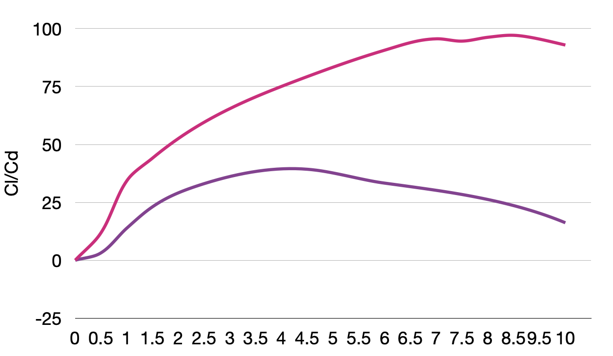

# The Problem
We want to know how to fly a helicopter on Mars

## First Steps
Before you begin, take the time to watch the vid below, keep in mind the rotational speed of the blades...:

<iframe display="block" width="560" height="315" src="https://www.youtube.com/embed/y5niGi4k9vQ" title="YouTube video player" frameborder="0" allow="accelerometer; autoplay; clipboard-write; encrypted-media; gyroscope; picture-in-picture" allowfullscreen></iframe>

We will also need to to know a bit about the properties of the Mars atmosphere:

\\(
    \begin{align}
\rho &= 0.02~\text{Kg/m}^3\newline
g &= 3.7~\text{m/s}^2\newline
\mu &= 9.82\times10^{-6}~\text{kg m}^{-1}\text{s}^{-1}
\end{align}
\\)

... and the Mars helicopter: Ingenuity

\\(
    \begin{align} \text{Diameter (blades)} &= 1.2m\newline        \text{Mass} &= 1.8\text{kg} \newline        \text{power} &= 350\text{watts}
    \end{align}\\)

## Lift, Drag and Angle of attack

Consider the plot below showing the lift to drag ratio vs angle of attack for two Reynolds numbers (pink: 3x10^5, purple: 1.3x10^5):

**Note this plot is for a NACA 0010 aerofoil, so you may wish to find some information on this aerofoil**

{: style="width:50%; display:block;margin:0 auto"}

>## Challenge
> What is the lift to drag ratio for an AOA of 8 degrees?
> > ## Solution
> > - It is important to understand that we need to make some assumptions about the Reynolds number here... so we assume turbulent but we must come back and check this.
> > For Re ~ 3x10^5 our Cl/Cd is around 100, and for Re ~ 1.3x10^5 our Cl/Cd is approx 25.
> {: .solution}
{: .challenge}

>## Challenge
> What is the optimal operating AOA for the large Re and for the smaller Re?
> > ## Solution
> > - Large = around 8-9 degrees
> > - Small = around 4 degrees
> {: .solution}
{: .challenge}

From the challenges above we notice some interesting things:

- Our ratio between lift and drag changes as the angle of attack changes for a constant Re.
- At higher Re we need to adjust our angle of attack in order to fly more efficiently...

## Now let's solve our problem

So we have some insight into how our aerofoil on our helicopter will behave. But there are still some outstanding things. For example how do we use our lift to drag ratio to calculate lift? Or visa versa...

There are a couple of ways to do this, suppose we want to calculate at what speed the blades must move in order for Ingenuity to hover:

>## Challenge
> What is the lift force required to keep Ingenuity hovering?
> > ## Solution
> > - 6.66 N
> {: .solution}
{: .challenge}

If we now used the rotational speed of the blades we could calculate the velocity of the blade:

>## Challenge
> What is the relationship between angular velocity \\(\omega\\) and linear velocity \\(U\\)?
> > ## Solution
> > - \\(\omega = \frac{U}{R}\\), where R is the radius
> {: .solution}
{: .challenge}

>## Challenge
> How do you convert revolutions per minute to radians per minute/second?
> > ## Solution
> > - One revolution is \\(2\pi\\) Radians
> > - \\(\omega = \frac{2537\times 2 \pi}{60}\\)
> {: .solution}
{: .challenge}

>## Challenge
> What is \\(U\\) at the tip of the blade? What is \\(U\\) at the centre?
> > ## Solution
> > - \\(U_\text{tip}= 1.2\omega\\)
> > - \\(U_\text{centre}= 0.6\omega\\)
> {: .solution}
{: .challenge}

Let's pause for a second... So we have our lift force (6.66 N) and our velocity at various points on our blade. But what do we do with this? 

- Firstly let's assume a linear distribution of linear veclocity along our blade so we can use the mean velocity in our calcs.
- So then our coefficient of lift is calculated as \\[C_L=\frac{2F_L}{\rho\times (0.6\omega)^2A}\\]

>## Challenge
> What is A?
> > ## Solution
> > - The projected area
> > - We could assume this as the area of the blade, so 1.2*0.12 (assume an aspect ratio of 10)
> {: .solution}
{: .challenge}

- But what about drag? Well if we know our angle of attack we can calculate the Cl/Cd ratio from our figures above.
- We have now calculated Cl so we can figure out what Cd is and subsequently what the drag force will be.
- What area will you use in your calculation?

>## Challenge
> What area will you use in your calculation for Drag?
> > ## Solution
> > - The frontal area
> {: .solution}
{: .challenge}

>## Challenge
> What will our power consumption be is we are hovering?
> > ## Solution
> > - \\(\text{Power} = \text{force}\times\text{velocity}\\)
> > - our force here is the drag force
> {: .solution}
{: .challenge}

## Lastly
As I mentioned earlier this is only one way of calculating this information. There are many things we could do. For example for a given acceleration we could estimate how much power consumption we would use.
- Can you think about how to do this?
- We could also use our Cl/Cd graph to adjust our angle of attack to always optimize our lift force and therefore conserve battery life.